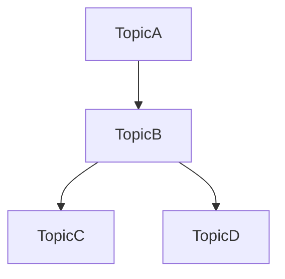
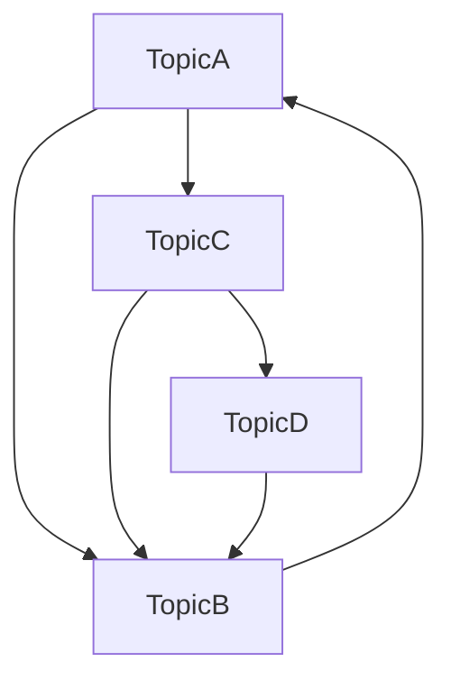

*Backlinks* are links on a web page/note that list other web pages/notes which refer to it. Within my digital garden, backlinks are critical in making connections between ideas. They are important because content does not always flow in one direction and knowing what links to a particular page can create a more informative context or open up new avenues of learning.

## Backlinks are not hierarchical

If *TopicA* links to *TopicB*, it may not be obvious that there is a connection when looking at *TopicB* particularly as content in a [[Digital Garden]] is almost always non-hierarchical. Instead of:

we have:

It's a lot of work to create and maintain all these backlinks and secondly, by simply writing and linking pages, the list of backlinks can highlight connections between pages in unexpected ways which generate new ideas and relationships.

## To be useful backlinks must be automatically generated
Creating backlinks by hand gets old, very quickly. There two primary reasons for this are:

1. [[Interrupting the Flow of Work has a Tax]] and the mechanical act of linking pulls you out of your thinking. That disjoint and shift of focus means it takes a moment to get back into the groove.

3. If you change the name of a note you have to find all the backlinks from other pages and rename them. This makes it hard to be productively lazy.

I use [[Obsidian]] to manage my content and it automatically creates the backlinks for each page. It also shows my potential backlinks ie., pages which refer to the name of a page but which have not been explicitly linked yet.
