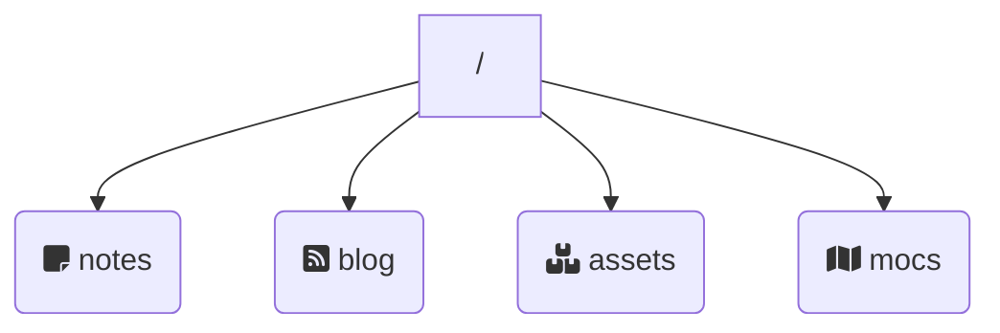

---
tags:
  - the-garden-shed
date: 2023-09-14
growth: budding
publishDate: 2023-09-19T19:21:00
---
An [[Obsidian]] to website publishing system that allows me to publish directly out of my [[Digital Garden]] and so retain the benefits of a single, frictionless workflow.

[Official site on Github](https://quartz.jzhao.xyz).

[The Quantum Garden](https://quantumgardener.blog) moved to Quartz in September 2023.

## Folder Structure

- **[notes](/notes/index)** is the folder where most of the garden's content is kept.
- **blog** holds transitional notes, relevant only to a point in time.
- **assets** holds supporting images and attachments.
- [mocs](/mocs/index) holds the site's [[Maps of Content]].

## Customisations for *The Quantum Garden*
The modifications I've made from [the original codebase](https://github.com/jackyzha0/quartz) are listed below with the file(s) where the change has been made. You're more than welcome to view them in-situ at the [site's Github repository](https://github.com/quantumgardener/qg.blog). The majority are to support [[Designing The Quantum Garden]] and others are purely informational/cosmetic.

**Remove links to pages that don't exist** - I believe it's poor design to link to any pages that I can know don't exist.
- `\quartz\plugins\transformers\ofm.ts`

**Hide tags from the Graph view** -- At this stage of the garden's development this hides the fact that many pages are not as inter-linked as they should be.
- `\quartz.layout.ts`

**Force all URLs and links to lower case** -- For future proofing as mixed case URLs only cause problems when page names change.
- `\quartz\plugins\transformers\ofm.ts`
- `\quartz\util\path.ts`

There is also a custom rule applied to Cloudflare to convert all incoming URLs to lower case for any off-site references except if the file is `/static/contentIndex.json` as that breaks Search.

**Hide folder structure** -- The folder structure behind the site doesn't add as much value as good writing and linking.
- `\quartz.layout.ts`

**Automatically show social icons** -- Save me some work for any new social links in the footer. Solving for this change improved my [[Javascript]] knowledge.
- `\quartz\components\Footer.tsx`
- `\quartz.layout.ts`

**Format dates to my liking** -- Some small configuration options
- `\quartz\components\Date.tsx`

**Display [[Seedling]], [[Budding]] or [[Evergreen]] status** -- Automated from a `growth` property on each page in preference to using tags because the purpose of the information is different.
- `\quartz\components\ContentMeta.tsx`

**Display .webp images** -- Include images for the new compressed web image format.
- `\quartz\plugins\transformers\ofm.ts`

**Display tag icon** -- display tags with a icon rather than a `#`
- `quartz\components\PageLiist.tsx`
- `\quartz\components\TagList.tsx`